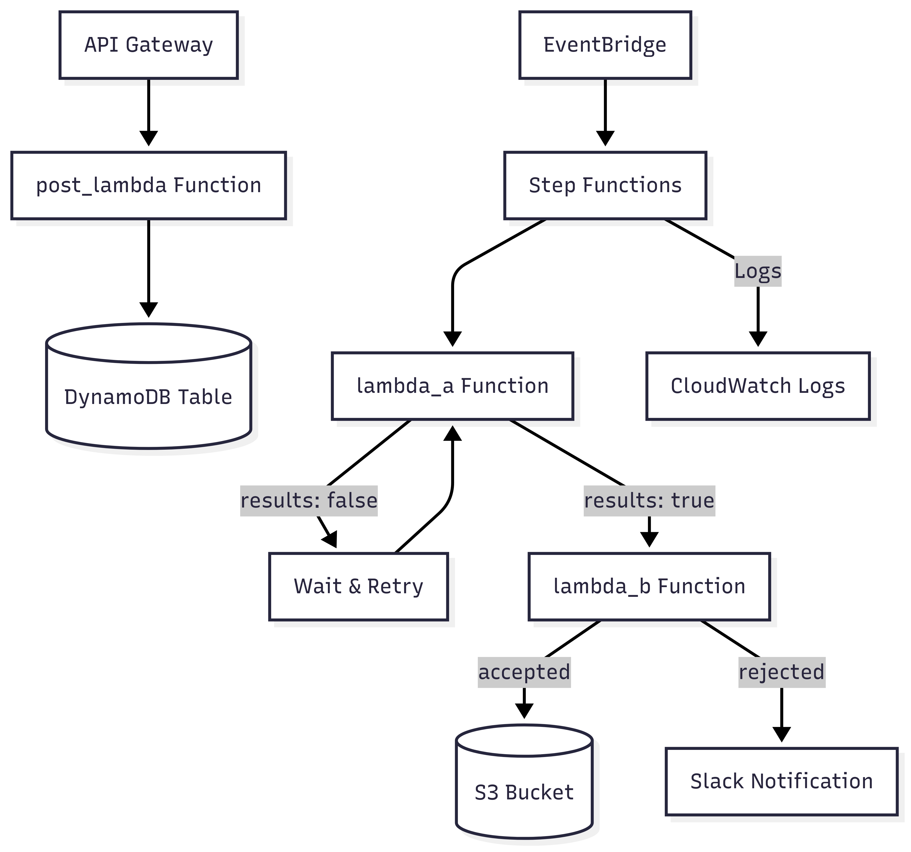
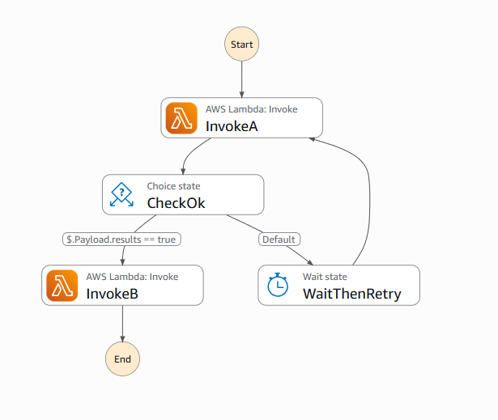
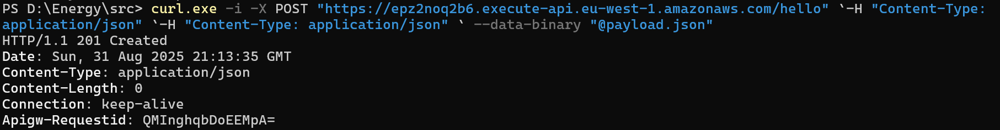
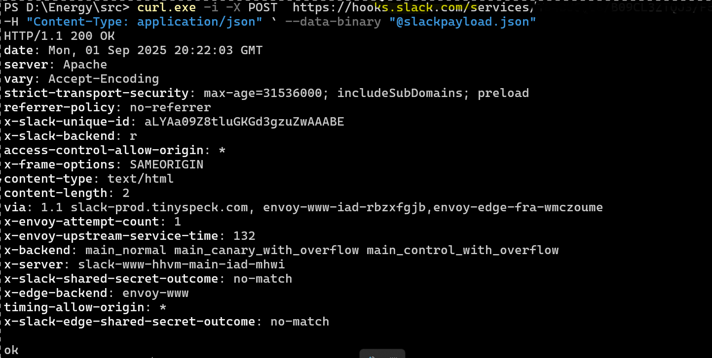
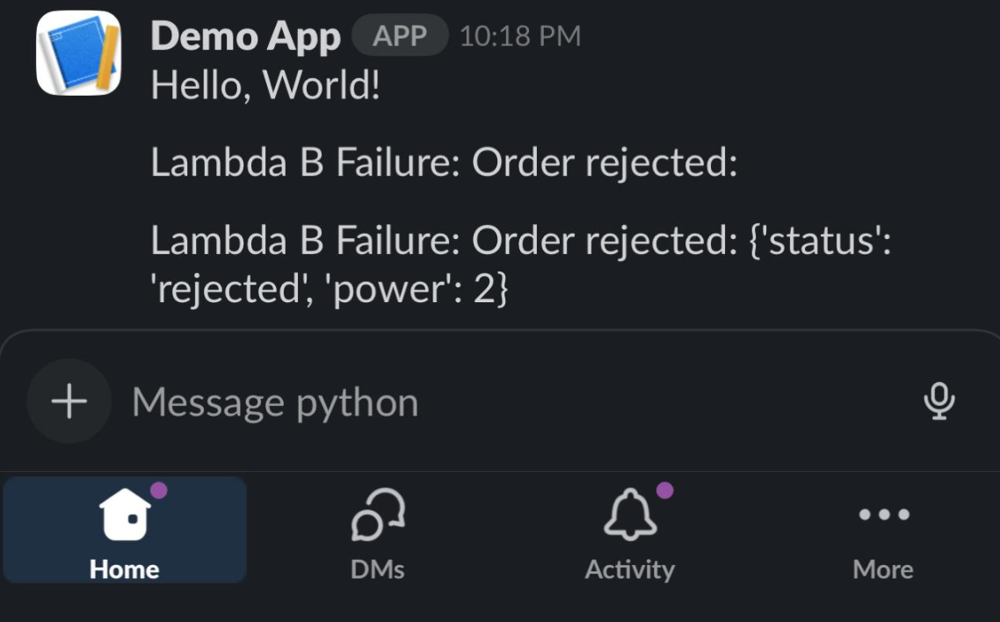

# Energy

Serverless application for participating in an energy-market auction using AWS. The repo includes Lambda functions, configuration files, and infrastructure templates (SAM/CloudFormation).




## Table of Contents

- [Project Structure](#project-structure)
- [Main Components](#main-components)
- [Workflow](#workflow)
- [Infrastructure & Deployment](#infrastructure--deployment)
- [Getting Started](#getting-started)
- [CI/CD Build (buildspec.yaml)](#cicd-build-buildspecyaml)
- [Configuration Notes](#configuration-notes)
- [Troubleshooting](#troubleshooting)


## Project Structure

```
Energy/
├── buildspec.yaml                # CodeBuild spec: SAM build + package (outputs packaged.yaml)
├── README.md                     # Project documentation
├── Energy_workflow.png           # Architecture/workflow diagram
└── src/
    ├── payload.json              # Sample API payload
    ├── pipeline-dev.yaml         # CodePipeline (dev) definition
    ├── slackpayload.json         # Example Slack message payload
    ├── template.yaml             # SAM/CloudFormation template (infrastructure)
    ├── lambda_a/
    │   ├── app.py
    │   └── requirements.txt
    ├── lambda_b/
    │   ├── app.py
    │   └── requirements.txt
    └── post_lambda/
        ├── app.py                
        └── requirements.txt
```

---

## Main Components

### Lambda Functions
- **post_lambda** (`src/post_lambda/app.py`): HTTP/API requests to Lambda that validates and stores incoming orders in **DynamoDB**. Items are written with a **24-hour TTL** to automatically expire old orders.
- **lambda_a** (`src/lambda_a/app.py`): Processes orders and returns a boolean `result`. The Step Functions state machine **waits** and **retries** if `result=false` (bounded by max attempts).
- **lambda_b** (`src/lambda_b/app.py`): Consumes the outcome from Lambda A.  
  - **Accepted** → writes results to an **S3 results bucket** (e.g., `order-results`).  
  - **Rejected/Error** → raises an error that triggers a **notification** to Slack as well as stores logs in CloudWatch.

### Templates
- **buildspec.yaml**: CodeBuild steps to `sam build` (in `./src`) and `sam package` to an S3 **packaging** bucket; generates `packaged.yaml` at repo root (artifact for deployment).
- **pipeline-dev.yaml**: Creates **CodePipeline** definition for development.
- **template.yaml**: SAM/CloudFormation template defining API Gateway, Lambdas, Step Functions, EventBridge, DynamoDB, IAM, S3, and CloudWatch.
- **payload.json / slackpayload.json**: Sample payloads for API and Slack.

---

## Workflow

1. **Order Submission (API)**
   - **API Gateway** invokes **post_lambda**, which validates and stores orders in **DynamoDB** with **TTL=24h**.
2. **Scheduled Processing**
   - **EventBridge rule** runs on a **configurable schedule** (default: **every 2 minutes**) and starts the **Step Functions** state machine.
3. **State Machine**
   - **Invoke A** → `lambda_a` evaluates the order and returns `result: true|false`.
     - If `false`, **Wait** (e.g., `RetrySeconds`) and **Retry** up to a configured maximum.
     - If `true` , proceeds to `Invoke B`.
   - **Invoke B** → `lambda_b` handle outcomes:
     - **Accepted** → store results in the **S3 results bucket** (parameter such as `orderResultBucketName`).
     - **Rejected/Error** → raise error → send **Slack** notification (based on `test/slackpayload.json`).
     


## Infrastructure & Deployment

- **SAM/CloudFormation (`src/template.yaml`)** defines:
  - API Gateway, Lambda functions, Step Functions, EventBridge, DynamoDB (with TTL), S3 buckets, IAM roles/policies, and CloudWatch Logs.
- **CI/CD**:
  - **CodeBuild** uses `buildspec.yaml` to compile and package; `sam package` uploads to an S3 **packaging** bucket (e.g., `build-packaging-eu-west-1`) and writes `packaged.yaml` at the repo root.
  - **CodePipeline** (e.g., from `src/pipeline-dev.yaml`) consumes the artifact **`packaged.yaml`** and deploys via CloudFormation/SAM.

> **Note:** The **packaging** S3 bucket used by `sam package` is different from the **results** bucket used by Lambda B.


## Getting Started

1. **Clone the repository**
   ```bash
   git clone https://github.com/lkhamitkar/energy.git
   cd energy
   ```
2. **Review functions & template**
   - Browse `src/` and `src/template.yaml`.
   - Install dependencies for lambda
        ```bash
        cd src/lambda_a && pip install -r requirements.txt
        cd ../lambda_b && pip install -r requirements.txt
        cd ../post_lambda && pip install -r requirements.txt
        ```
3. **Prepare packaging bucket**
   - Ensure an S3 bucket (e.g., `build-packaging-eu-west-1`) exists and CodeBuild can write to it.
4. **Run CI build**
   - Trigger your CodeBuild project that uses `buildspec.yaml` → artifact `packaged.yaml` will be produced at repo root.
5. **Deploy**
   - Use CodePipeline or `sam deploy`/CloudFormation to deploy **`packaged.yaml`**.

**TIPS**
- **Sample requests**
  - Use `test/payload.json` to test the POST API locally or in a dev stack.


## CI/CD Build (`buildspec.yaml`)

This build spec:
- Uses **Python 3.11** and installs **AWS SAM CLI**.
- Builds the SAM app from `./src`.
- Packages the stack to an S3 **packaging** bucket.
- Emits **`packaged.yaml`** at the repo root as the sole artifact.

```yaml
version: 0.2
phases:
  install:
    runtime-versions:
      python: 3.11
    commands:
      - pip install --upgrade pip
      - pip install aws-sam-cli
  build:
    commands:
      - echo "== SAM build from ./src =="
      - pwd && ls -la && ls -la src
      - cd src
      - sam build
      - echo "== SAM package to repo root packaged.yaml =="
      - sam package --s3-bucket build-packaging-eu-west-1 --output-template-file "$CODEBUILD_SRC_DIR/packaged.yaml"
artifacts:
  files:
    - packaged.yaml
```

---

## Configuration Notes
- **GitHub Integration** : Integrated with Oauth. Refer [GitHub Docs](https://docs.github.com/en/apps/oauth-apps/building-oauth-apps/creating-an-oauth-app) for more information.
- **APIGateway Test**:  Curl locally and test the Response with bash, powershell. Traverse through test folder and execute
    ```powershell
    curl.exe -i -X POST https://epz2noq2b6.execute-api.eu-west-1.amazonaws.com/hello `-H "Content-Type: application/json" ` --data-binary "@payload.json"
    ```
    
- **Schedule**: EventBridge default is **every 2 minutes** (adjust in the template or via parameters).
- **Buckets**:
  - **Packaging bucket** (for `sam package` artifacts) — e.g., `build-packaging-eu-west-1`.
  - **Results bucket** (written by Lambda B) — parameter like `orderResultBucketName`.
- **Permissions**:
  - CodeBuild service role needs `s3:PutObject`, `s3:GetObject`, `s3:ListBucket` on the **packaging** bucket.
  - Runtime roles for Lambdas/State Machine/EventBridge/DynamoDB/S3 are defined in `src/template.yaml`.
- **Slack Notification** : Create a webhook URL for your workspace. To dispatch messages with your webhook URL, send your message in JSON as the body of an application/json POST request.
    ```bash
    curl -X POST -H 'Content-type: application/json' --data '{"text":"Hello, World!"}' URL
    ``` 
    
    Demo Notication:
    

## Configuration tips

**RetrySeconds** – Increase for less aggressive polling; decrease for faster convergence (watch costs and concurrency).
**lambda_b resiliency** – Add Retry/Catch in the state machine to handle transient S3 issues and route failures to alarms/queues.
**Event-driven start** – Add an EventBridge EventPattern rule using EventSource/EventDetailType if you want to kick off processing when post-lambda emits an event (instead of a schedule).
**Security/observability** – Enable API access logs, auth (JWT/authorizer), X-Ray tracing, and tighter IAM scoping as needed. Best case is to use a RBAC stack, as we do not have abundant amount of roles and policies we are keeping it in  lite mode.
**Secrets Store** - keys/tokens are encrypted at rest (KMS) and never live in plain text in code or build logs. We could have referenced AWS Systems Manager Parameter Store (SecureString) but while working with bigger code base its best to use Secret Manager.


## Troubleshooting

- **`sam: command not found`**  
  Ensure `aws-sam-cli` installs successfully and the build image supports Python 3.11.
- **`AccessDenied` uploading artifacts**  
  Verify the **packaging bucket** exists and CodeBuild role has S3 write/list permissions.
- **`packaged.yaml` missing in artifact**  
  Confirm `--output-template-file "$CODEBUILD_SRC_DIR/packaged.yaml"` and `artifacts.files: packaged.yaml`.
- **`AccessDenied` on S3** – confirm `orderResultBucketName` exists and the Lambda role has permissions (it does in the template; ensure bucket policy allows it if restricted).
- **DynamoDB errors** – the table is **external**. Verify:
  - The ARN (account/region/table name) is correct.
  - The table exists and you are writing the right partition/sort keys.
  - The Lambda role has the needed actions (PutItem, UpdateItem, GetItem, Query, Scan).
  - (If you rely on expiry) TTL is enabled and the TTL attribute is being set.
- **Executions run for a long time / never end** – make sure `lambda_a` returns a boolean `results`. Add a max-attempts counter or an overall execution timeout. Inspect the Step Functions execution history and CloudWatch logs for `lambda_a`. For larger workloads check the Memory and CPU.
- **EventBridge didn’t trigger the state machine** – confirm the rule is `ENABLED`, the `ScheduleExpression` is valid, and the target ARN is your state machine. Ensure the `EventBridgeToSFNRole` has `states:StartExecution` and no SCP/permission boundary is blocking it.
- **API 403/404/500** – verify you are calling `POST /frontend` on the `$default` stage. Check that the Lambda permission `PostLambdaPermissionForHttpApi` SourceArn matches `.../${HttpApi}/*/*`. Ensure the integration uses payload format **1.0** and your Lambda returns a proper **proxy response**.
- **Malformed Lambda proxy response** – for HTTP API proxy, `body` must be a **string**. JSON-serialize it, e.g. `json.dumps({...})`. Set `isBase64Encoded=true` only for binary responses.
- **Throttling/429** – `InvokeA` already retries certain Lambda errors. Consider increasing `RetrySeconds`, adding exponential backoff, or setting reserved concurrency on the functions.

---

## Final checklist for executing the first time:

- [ ] AWS Configured and pulled the code
- [ ] DynamoDB table exists and ARN is correct (`RecordDynamoTableNameArn`)
- [ ] Results S3 bucket exists and is reachable (`orderResultBucketName`)
- [ ] CodeBuild/packaging bucket exists for `sam package` (if using CI/CD)
- [ ] Lambdas return the expected shapes (`lambda-a` → `{ "results": true|false }`)
- [ ] EventBridge rule is **ENABLED**; Step Functions role can invoke Lambdas
- [ ] API call uses `POST /frontend` and Lambda returns a valid proxy response
- [ ] CloudWatch Logs show healthy invocations for API, Lambdas, and SFN

---
## Improvements Suggested
**Architecture & State machine**

Add timeouts:
Lambda_A can loop forever. Add TimeoutSeconds/HeartbeatSeconds, a max-attempt counter in state, and a terminal “give-up” path (with alert). Also keep the transient-error Retry, but add Catch for non-retryable errors. 
Tracing on by default: 
Enable X-Ray for Lambda and Step Functions to trace A→B executions and API calls end-to-end. 
Event triggers:
We already have a schedule; if we keep the optional custom EventBus params,  we use them with an EventPattern rule (source/detail-type) 

**API Gateway**
Auth:
Add a IdP or IAM, consider WAF for common exploits. 
Input validation: attach JSON Schema request validation at the API, not only in code. It blocks bad inputs early and reduces Lambda invocations. 
Access logs: enable access logs with careful field selection (PII)

**Lambda**
Layers & dependencies:
If multiple functions share libs, move them to a Lambda Layer.

**Data and Storege**
S3 results bucket: enforce server-side encryption, versioning, Object Ownership and bucket policies that scope access to the Lambda role principal.

**IAM & security**
Least-privilege policies:
DynamoDB to specific table, Step Functions to exact ARNs. Prefer resource-level conditions where possible. 
Secrets:
store webhooks/API keys in Secrets Manager or SSM Parameter Store (SecureString); fetch at runtime and grant only GetSecretValue/GetParameter to precise ARNs.

**Logging**
Metrics & alarms:
Create CloudWatch Alarms for Lambda Errors/Throttles, Step Functions ExecutionsFailed/TimedOut, and route to an SNS topic (Slack via webhook).
Structured logs:
JSON logs with request IDs, enable log retention (30 days) explicitly for all log groups

**CICD**
Multi-env pipelines:
Promote from dev→staging→prod with parameter overrides, per-env packaging buckets, and a manual approval gate before prod. 
Deploy safety:
Use SAM --capabilities CAPABILITY_IAM + change sets; for Step Functions/Lambda, consider canaries or gradual rollout where relevant.

**Github Actions**
Enabled action for 